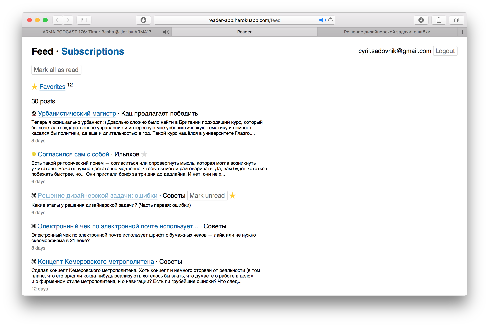

[](https://reader-app.herokuapp.com/)

# Reader 
Reader is a simple feed reader app.

## Background
I am learning Rails. To discover all quirks of it I started from naive implementation of this app. As I get comfortable with current implementation I will introduce new tools and refactor stuff. To make refactoring process less painful I try to write as much functional tests as I can.

## Development

### Install
```
make install
```

### Run server
```
make
```

### Run tests
```
make test
```

# [](https://travis-ci.org/sadovnik/reader) 👀
